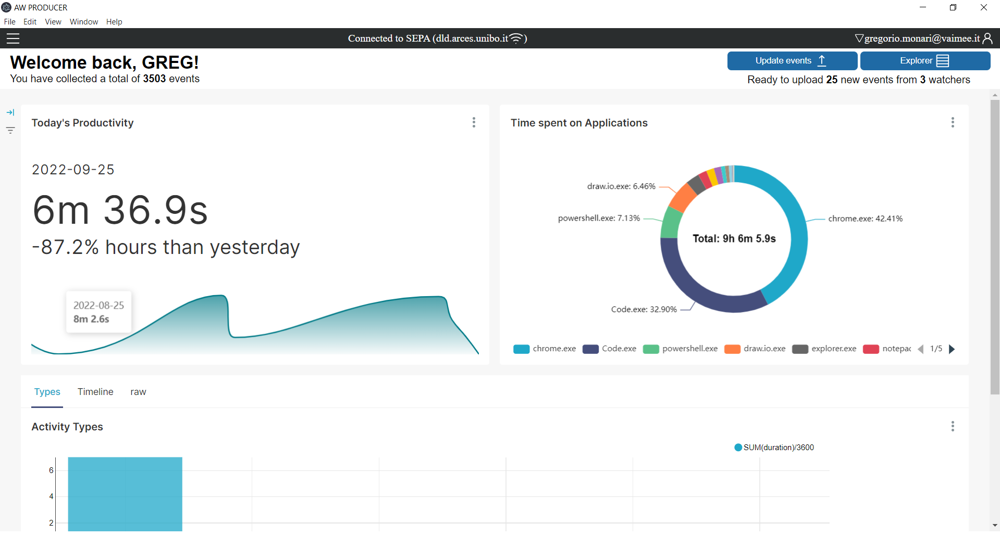

  <h1>MY2SEC: ActivityWatch-PRODUCER</h1>
  BRING ACTIVITY WATCH INTO THE CLOUD!  
  </img>

 

<!--#############
INTRODUCTION
###############-->
<h2>INTRODUCTION</h2>

  Built on top of the Activity Watch tracking app, the AW Producer allows to expand said app functionalities making it a "CLOUD-APP".   In general, an    ADAPTER   allows not only to upload data produced by a generic local app to a remote server, but also to "map" that data into "semantic data". 
  My2sec Servers run a semantic event processor, the SEPA, which allows to take all the advantages of a semantic based architecture, while maintaining speed and        scalability of the system.   In practice, the adapter is composed by two modules: Aw-producer and Aw-mapper. The end-user needs to download the Aw-Producer on   his host-machine, while the mapper needs to be deployed on the remote server. 

 

<!--#############
INSTALLATION GUIDE
###############-->
<h2>QUICK START</h2>

This guide will step you through download and installation of the ActivityWatch Producer application.

      
<h3>Prerequisites</h3>

  To use the application, you need to have Node.js installed in your system.
   
  To check that Node.js was installed correctly, type the following commands in your terminal client:
   
  <pre>node -v npm -v</pre>
  If one of the commands returns an error, please install Node.js from the official website: <a>https://www.nodejs.org</a>

<h3>Installation</h3>

  After cloning this repository, move the "src" folder wherever you want. 
   
  Open your terminal client and cd into the "src" directory, for example:
  <pre>cd c/Users/User/.../AW-Producer/src</pre>
  To install Electron on your system, in your terminal type:
  <pre>npm install --save-dev electron</pre>

<h3>Running the Application</h3>

  After the installation procedure has been completed, from the src directory type the following command in your terminal to start the application: 
  <pre>npm start</pre>

 
 
 
<h2>USAGE</h2> 

The Aw-Producer allows a User to manually upload data to a remote SEPA cloud. 
After the installation, the homescreen should look like this:
</img>
The flow of the application is composed by 3 steps: configuration, data fetch and data upload.

<h4>1- Configuration</h4> 

The app comes with a default configuration which can be changed from the menu:

  <ol>
    <li>Press the menu button on the top-left corner of the screen to open the configuration menu</li>
    <li>Set your username (es default.user@vaimee.it)</li>
    <li>Set the SEPA ip address (es dld.arces.unibo.it)</li>
    <li>Set the http port (es. 8500) and ws port (es. 9500)</li>
    <li>Set whitelisted watchers (es. aw-my2sec,aw-watcher-working)</li>
    <li>Press the save button. The APP will reload automatically</li>
  </ol>

<h4>2- Get data</h4> 

At startup, the application will automatically get the events from aw-server and display them to the user. Only the whitelisted watchers will be shown. 
The app will show the events of one watcher at a time, to view other watchers press the arrow buttons on the sides of the screen.

<h4>3- Upload data</h4> 

After fetching the events, the app will try to connect to the remote SEPA server. If connection is successful, a button will appear on the bottom of the screen. 
Pressing this button will start the upload procedure: if data is uploaded correctly, a popup will appear signaling the user of the succeeded operation.

<h2>TROUBLESHOOTING</h2> 

The application is still in development, so it has not been signed yet. Some operating systems like macos are very strict on running unsigned applications: if you have trouble starting the application try with this link: https://support.apple.com/it-it/guide/mac-help/mh40616/mac 
If you have other issues during the usage of the application please report them as an issue here on GitHub! Meanwhile, try to restart the application...

<h2>COMING SOON</h2> 

- Keycloack user management 
- UI and UX improvements 
- Integration with my2sec scanner

 
  
  

